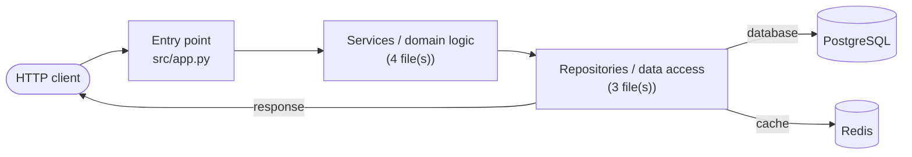

# trinkets

A collection of small, self-contained developer utilities.

Every tool here is deliberately stdlib-only at its core, so it runs from a clean
checkout without a virtualenv, a lockfile, or a network round trip.

| Utility | What it does |
| --- | --- |
| [`repostats`](#repostats) | Analyses a git repository and reports languages, build tooling, purpose, contributors, architecture flow, external dependencies, size metrics, and test coverage. |

---

## Install

```bash
git clone git@github.com:vijayrc/trinkets.git
cd trinkets
pip install -e .
```

Or run it straight from the source tree with no install at all:

```bash
PYTHONPATH=src python3 -m trinkets.repostats.cli /path/to/repo
```

Requires Python 3.11+ (uses `tomllib`) and `git` on `PATH`.

**Optional extras**

```bash
pip install -e ".[yaml]"   # more accurate docker-compose parsing
pip install -e ".[dev]"    # pytest, pytest-cov, ruff
```

Everything degrades gracefully without the extras — compose files fall back to a
regex scan when PyYAML is absent.

---

## repostats

Points a static analyser at a git repository and answers eight questions about
it. Nothing is uploaded anywhere; every check is local and read-only.

### Usage

```bash
repostats                          # analyse the current directory
repostats ~/code/myapp             # analyse another repository
repostats -f json -o report.json   # machine-readable output
repostats --max-commits 5000       # cap history scan on huge repos
repostats --run-coverage           # execute the repo's pytest suite (see warning)
```

Via the parent dispatcher:

```bash
trinkets repostats ~/code/myapp
```

### What it reports

1. **Programming languages** — file counts, code/comment/blank line splits and
   percentage share per language. Config and markup (YAML, JSON, Markdown, …)
   are tallied separately so they can't drown out actual source.
2. **Build tool and model** — detected build systems, package managers, PEP 517
   backend, CI providers, containerisation, and whether the repo is a single
   project, a multi-project layout, or a declared monorepo with workspaces.
3. **Purpose and overall logic** — inferred from README, package metadata,
   detected frameworks, entry points and recurring path vocabulary.
4. **Contributors and timeframe** — commits, distinct authors, active span,
   per-year histogram, insertion/deletion churn, and a bus-factor estimate.
5. **Flow diagram** — a Mermaid `flowchart LR` from caller through entry point,
   controllers, services and repositories to datastores, caches and queues.
6. **External dependencies** — databases, caches, message brokers, search,
   cloud, observability and auth systems, resolved from three independent
   sources: package manifests, container images, and import statements.
7. **Size and structure** — LOC breakdown, class/type and function counts, HTTP
   endpoint inventory, comment ratio and the largest source files.
8. **Testing and coverage** — frameworks, runners, test-to-source ratio, test
   case counts, and line coverage read from any existing coverage report.

Output is Markdown by default (drop it straight into a PR or a wiki) or JSON for
piping into other tools.

### Example

```
$ repostats ~/code/orders-api

## 6. External dependencies and infrastructure

### Systems this code talks to

| Category | Systems |
| --- | --- |
| Database | PostgreSQL |
| Cache | Redis |
| Messaging | Apache Kafka |
| Web Framework | Flask, Gunicorn (WSGI server) |
```



---

## Design notes

### Measured vs. inferred

The report separates what was **counted** from what was **guessed**, and labels
every inferred section with a confidence level. Sections 1, 4, 6 and 7 are
largely measurement. Sections 3 and 5 are inference, and say so in their
headings. Each inferred node carries an evidence block naming the files that
produced it, so a wrong conclusion is traceable rather than mysterious.

If there isn't enough signal to draw a flow, the tool says that instead of
inventing an architecture:

> Not enough structural signal to infer a meaningful flow. The repository has no
> recognisable layer directories, HTTP routes, or datastore dependencies — it is
> most likely a library or a flat script collection.

### Coverage is read, not run

`repostats` does **not** execute the analysed repository's test suite by
default. Doing so means running arbitrary third-party code, which is not a
reasonable thing for an analysis tool to do silently. Instead it reads coverage
from reports the repo already contains — Cobertura/JaCoCo XML, `coverage.json`,
Istanbul summaries, or `lcov.info`.

`--run-coverage` opts into executing `pytest --cov`. Only use it on code you
trust.

### One pass over the tree

The walker reads each file exactly once and hands the decoded text to every
probe, so an eight-part report costs a single traversal. File discovery prefers
`git ls-files --cached --others --exclude-standard`, which honours `.gitignore`
while still including uncommitted work in progress.

Vendored directories, lockfiles, minified bundles, generated protobuf output and
binaries are excluded from source counts.

---

## Known limitations

Worth reading before you trust a number.

- **String literals can produce phantom endpoints.** Route detection strips
  comments but not string literals, so a framework route written inside a test
  fixture or a docstring is counted as a real endpoint. This repo triggers its
  own bug: `tests/test_repostats.py` contains Flask routes as fixture strings,
  so `repostats` reports trinkets as an "HTTP service / web API".
- **Class and function counts are exact only for Python** (via `ast`). Every
  other language uses declaration regexes — close, but it will miss unusual
  formatting and can over-count. The report states which languages got which
  treatment.
- **The flow diagram is a layer sketch, not a call graph.** It is built from
  directory and filename conventions. A codebase that doesn't name things
  `service/`, `repository/` and so on will produce a thin diagram even if it is
  well architected.
- **Purpose inference is only as good as the README.** With no README and no
  package description, it falls back to "a `<language>` project".
- **Bus factor is a commit-count heuristic**, not a knowledge-distribution
  measure. Someone with few commits may still be the only person who
  understands a subsystem.
- **Shallow clones** produce truncated history; the report warns when it detects
  one.
- Dependency classification covers a curated list in `knowledge.py`. Unknown
  packages land in the `other` bucket rather than being guessed at.

---

## Development

```bash
pip install -e ".[dev]"
pytest                       # run the suite
pytest --cov                 # with coverage
ruff check src tests         # lint
```

> **Status:** the test suite in `tests/` is written but has not yet been
> executed in this environment — `pytest` was unavailable at the time of
> writing. Treat a green run as unconfirmed until you have one.

### Adding a utility

1. Create `src/trinkets/<name>/` with a `cli.py` exposing `main(argv)`.
2. Register it in `UTILITIES` in `src/trinkets/cli.py`.
3. Add a `[project.scripts]` entry in `pyproject.toml` if it deserves its own
   binary.

Utilities are imported lazily, so a heavyweight or broken tool never slows down
or breaks the others.

### Layout

```
src/trinkets/
├── cli.py                  # dispatcher across utilities
└── repostats/
    ├── analyzer.py         # orchestrator: walk once, run every probe
    ├── walker.py           # file discovery + per-file line counting
    ├── gitio.py            # read-only git CLI wrapper
    ├── languages.py        # extension -> language, comment syntax
    ├── knowledge.py        # package/image -> infrastructure mapping
    ├── models.py           # report dataclasses
    ├── probes/             # one module per report section
    └── render/             # markdown and json output
```

## Licence

MIT
